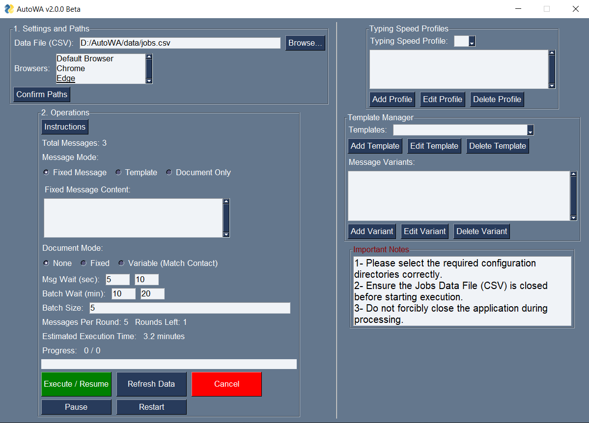

# AutoWA — Professional WhatsApp Outreach & Workflow Automation

AutoWA is a desktop automation platform built to streamline large-scale WhatsApp communication workflows with human-like behavior simulation, dynamic personalization, and document-based messaging.

Designed for agencies, recruiters, sales teams, and operations-heavy workflows, it transforms repetitive WhatsApp outreach into a controlled and scalable system.

[Demo Video](YOUR_VIDEO_LINK)

---

## The Problem

Manual WhatsApp outreach becomes unsustainable when working with:

- hundreds of leads
- repeated follow-ups
- personalized messaging
- document attachments
- multiple account sessions

Common challenges include:

- time-consuming repetitive tasks
- inconsistent personalization
- operational mistakes
- account safety risks from bot-like behavior
- lack of workflow visibility

Traditional bulk messaging tools often feel robotic and increase the risk of account restrictions.

---

## The Solution

AutoWA simulates realistic user behavior while providing structured workflow controls.

Key capabilities include:

- human-like randomized typing delays
- dynamic message templates
- batch interval control
- account rotation
- document attachments per contact
- live execution tracking
- recovery & resume workflows

This allows teams to scale WhatsApp communication while maintaining more natural interaction patterns.

---

## Demo

🎥 **Watch the full demo**
[Insert Loom / YouTube / LinkedIn video link]

Recommended demo flow:

1. import contacts CSV
2. select template
3. attach files
4. launch automation
5. show progress dashboard
6. demonstrate human-like pauses

---

## Use Cases

### Lead Generation & Sales Outreach
Send personalized first-touch and follow-up messages to lead lists.

### Recruitment & HR
Automate candidate communication and document delivery.

### Customer Support Operations
Handle repetitive support-side messaging workflows.

### Agency / Marketing Outreach
Scale campaign communication across multiple accounts.

### Internal Operations
Send structured reminders, approvals, and updates.

---

## Core Features

- **Human-like Execution:** Randomized typing delays and dynamic workflow pacing.
- **Dynamic Messaging:** Resolves custom template placeholders (e.g., `{company_name}`) accurately.
- **Variant Randomization:** Pick from multiple message variants to prevent repetitive spam detection.
- **Document Handling:** Safely attach individual or globally defined files (PDFs, Images) explicitly per contact.
- **Live System Health:** Monitor execution via an actionable Dashboard tracking metrics and throughput.
- **Automated Account Rotation:** Split batches across multiple active Chrome sessions seamlessly.
- **Smart Resumption:** Automatically resume from last processed state if interrupted.
- **Session Analytics:** Review throughput metrics per active session securely.

---

## Technical Documentation

**Are you a developer looking to contribute or understand the codebase?**
This system is strictly modularized with separate layers governing execution loops, GUI layouts, telemetry tracking, and DOM interactions. 

👉 **[Read the System Architecture & Technical Guidelines in `docs/README.md`](docs/README.md)**

---

## Known Constraints

- Windows desktop only
- foreground execution required
- image-recognition dependent
- currently optimized for Egyptian workflows
- dark mode support prioritized

---

## Roadmap

- analytics dashboard
- support-agent mode
- global number formatting
- multilingual UI
- richer interaction types